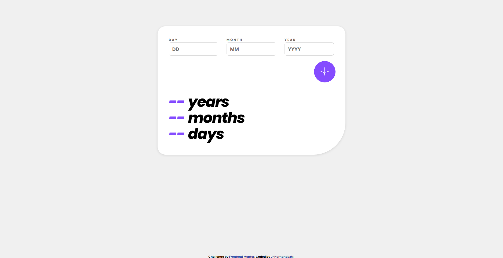

# Age calculator app solution

## Tabla de contenidos

- [Descripcion](#descripcion)
  - [El desafio](#el-desafio)
  - [Screenshot](#screenshot)
  - [Links](#links)
- [Mi proceso](#mi-proceso)
  - [Hecho con](#hecho-con)
  - [Lo aprendido](#lo-que-aprendi)
- [Autor](#autor)

## Descripcion

Solucion al reto de crear un aplicativo que calcule el tiempo vivido de una persona a partir de su cumpleanos, calculado utilizando Vanilla JavaScript.

## El desafio

El usuario deberia poder

- Ver su edad en anios, meses y dias despues de subir correctamente el formulario
- Recibir mensajes de validacion si:
  - Cualquier campo esta vacio
  - Alguna fecha no cumplen con los rangos logicos
  - La fecha es invalida e.g. 31/04/1991 (hay 30 dias en abril)
- Ver el layout optimo dependiendo de su tamano de pantalla.
- Ver la interaccion cuando se coloca el mouse encima de los elementos.
- **Bonus**: Ver una animacion cuando los numeros cambian.

## Screenshot

## Links

- Solucion: [GITHUB](https://github.com/J-HernandezM/age-calculator-app)
- Live site: [PAGES](https://j-hernandezm.github.io/age-calculator-app/)

## Mi proceso

Ya he realizado componentes o aplicativos como este anteriormente y este se me hizo bastante facil. No utilice ninguna libreria, asi que me tarde un tanto en entender como funcionaban las fechas en JavaScript Vanilla para poder darles manejo y busar los datos que necesitaba pero eventualmente lo logre.

Ademas los estilos CSS y la estructura HTML siento que la maneje con soltura

## Hecho con

- Semantic HTML5 markup
- CSS custom properties
- Flexbox
- CSS Grid
- Mobile-first workflow
- Vanilla JavaScript

## Lo que aprendi

Reforce mis conocimientos de maquetacion y estilos en CSS, ademas comprendi la logica de las fechas en JavaScript Vanilla y finalmente encontre que existe una libreria que es el estandar para estas situaciones de manejo de fecha llamada Moments que aprendere a usar en algun futuro.

## Autor

- Website - [Portfolio en construccion](https://j-hernandezm.github.io)
- Github - [@J-HernandezM](https://github.com/J-HernandezM)
- Twitter - [@__HernandezM](https://www.twitter.com/__HernandezM)